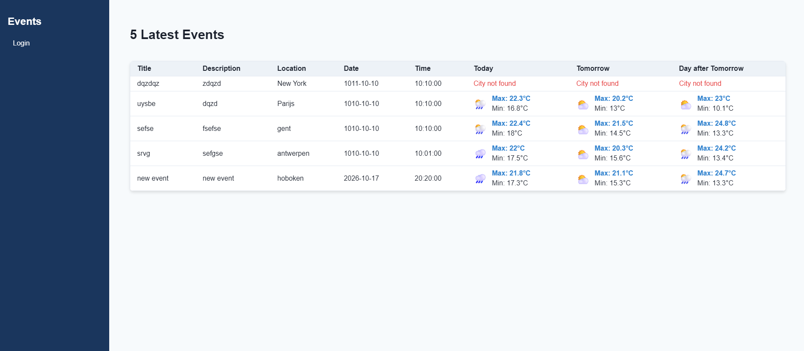
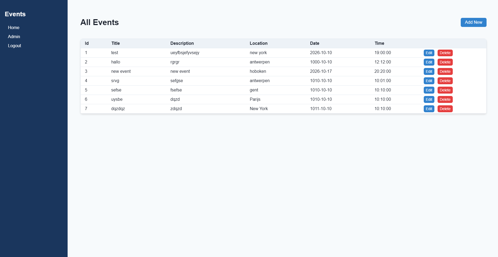
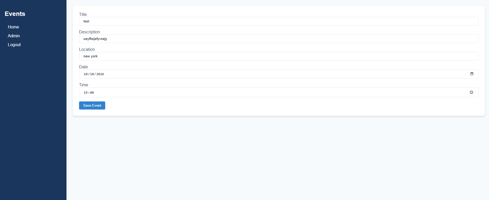

# Event Management App

Een webapplicatie voor het beheren van evenementen, gebouwd met een PHP MVC-framework. Bezoekers krijgen een overzicht van komende evenementen inclusief live weersverwachtingen op de locatie. Admins kunnen achter een login evenementen toevoegen, aanpassen en verwijderen.

## Stack

- **Backend:** PHP (MVC architectuur)
- **Database:** MySQL
- **Frontend:** JavaScript (ES6+), Axios, SASS (SCSS)
- **Build Tool:** Vite
- **API:** Open-Meteo Geocoding & Weather Forecast API

## Features

- **Publiek overzicht:** Toont de komende evenementen.
- **Live Weer-API:** Automatische ophaal van de 3-daagse weersverwachting per locatie via de [Open-Meteo API](https://open-meteo.com/).
- **Authenticatie:** Beveiligde login voor admins met sessiebeheer.
- **Admin Dashboard (CRUD):** Volledig beheer van evenementen (toevoegen, bewerken, bekijken en verwijderen).
- **Client-side Validatie:** Directe validatie op formulieren met JavaScript.

## Screenshots

### Homepage

### Admin dashboard

### Admin event editor

